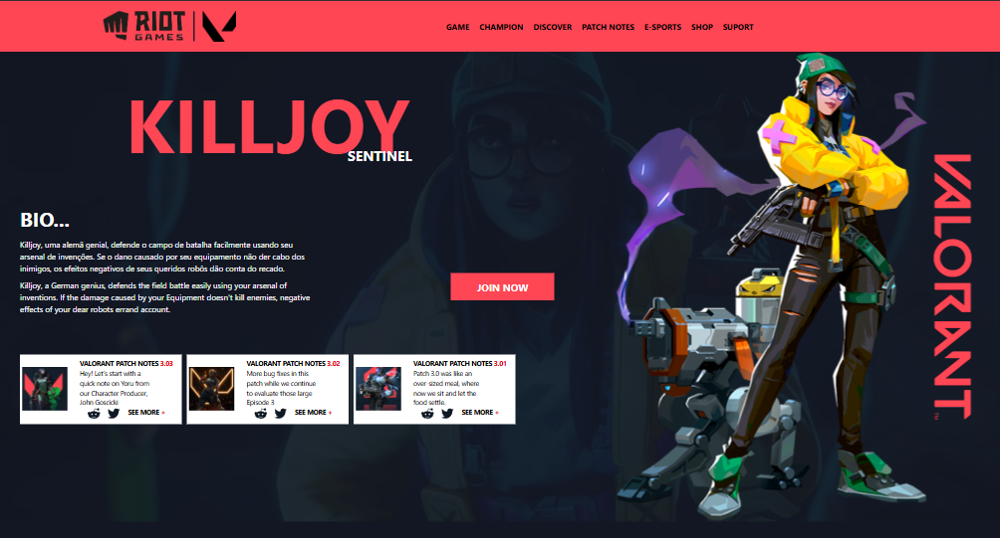
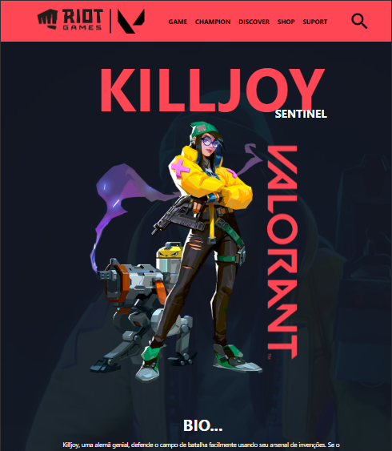
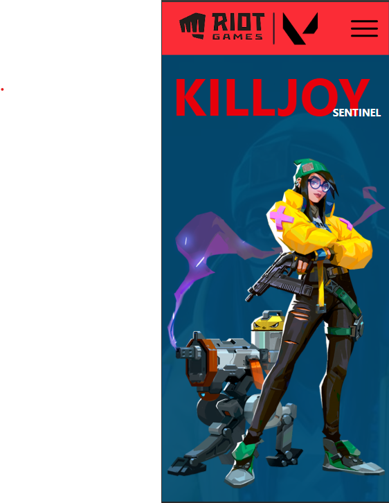

# Killjoy-Valorant

## Desktop

## Tablet

## Celular

Website criado para treino com o Tailwind CSS, utilizando apenas as ferramentas do Tailwind, sem o uso do CSS tradicional.
Além disso o website é responsivo, pensando não só para o usuario que usa um Desktop, mas também Tablet e Celular

## Tecnologias
* HTML
* Tailwind CSS
* Git

[Figma](https://www.figma.com/design/3WFGf8bwHHOOcZTyibbXVp/SAS-Valorant?node-id=0-1&t=3XFJVzxYSOLlDwGJ-1)

## Autor
[Eduardo Feitosa](https://www.linkedin.com/in/eduardo-batista-ab0910366/)